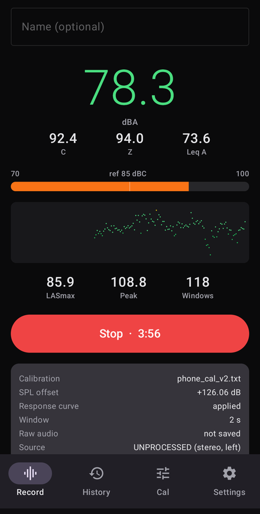
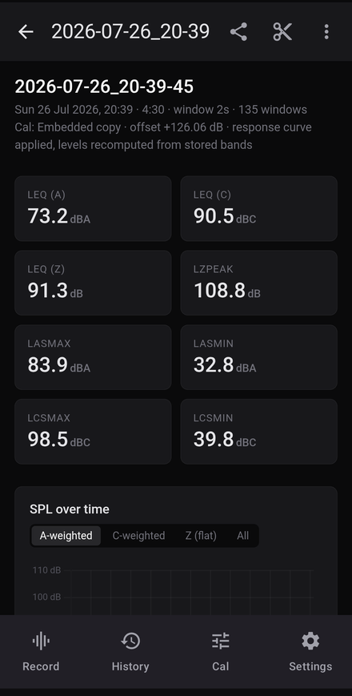
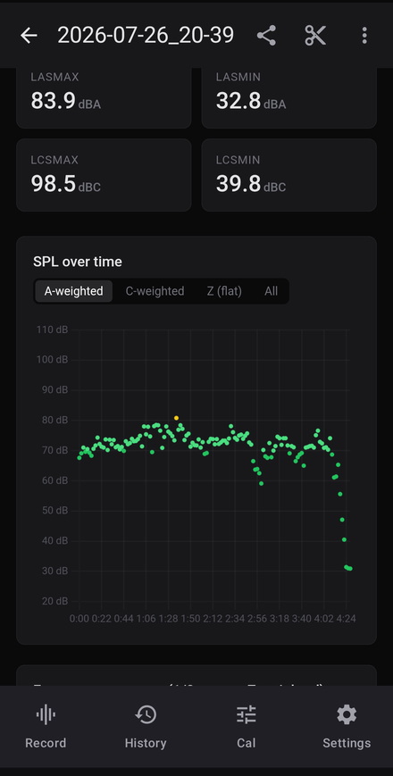
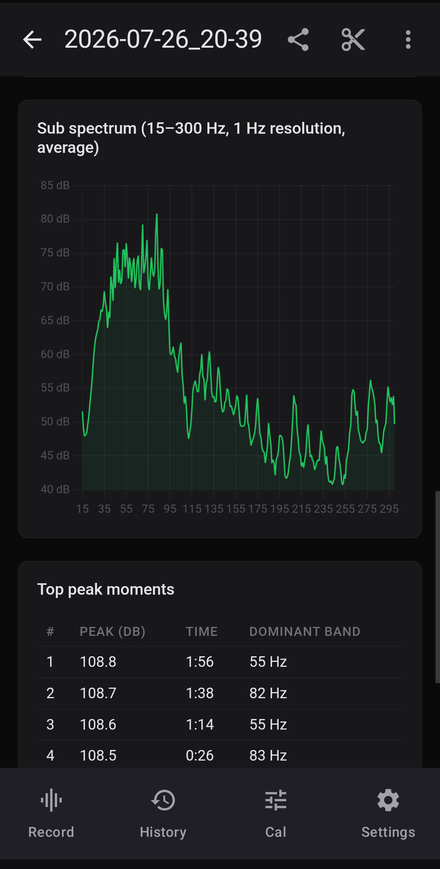
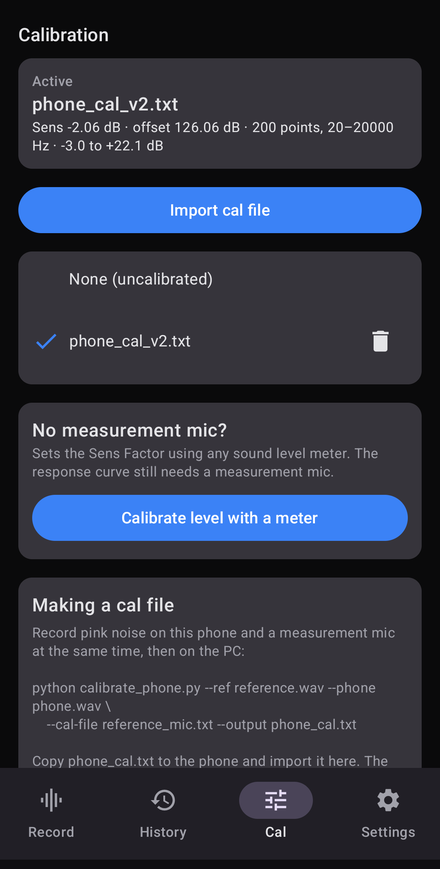
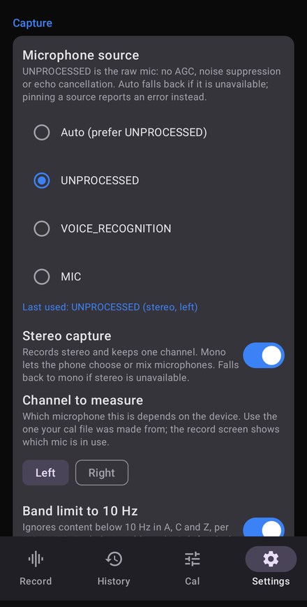

# SPL Meter

An Android sound level meter that measures calibrated SPL in real time, keeps a
compact spectral log of the whole session, and generates an HTML report.

Built for measuring loud environments over long periods — the sort of
measurement a handheld meter gives you a single number for, where you actually
want the whole time and frequency history.

<p align="center">
  
  
  
</p>
<p align="center">
  
  
  
</p>

## It stores measurements, not audio

Each analysis window is reduced to a set of levels and band powers, and the
audio itself is discarded. Nothing is retained that could be played back.

Per 2 s window: A/C/Z equivalent levels, Fast time-weighted maxima and minima,
peak level, 1 Hz resolution from 15–300 Hz, and 1/3 octave bands above that —
about **1.27 KB**, or roughly 7 MB for a three hour session.

Saving the raw audio as a WAV is available as an option, off by default. With it
off, no recording of the sound exists at any point after the two second window
that produced the numbers.

That is also what makes the measurements re-analysable: everything is stored
uncalibrated, so a calibration can be applied, changed or improved afterwards
and every past session updates with it.

## Measurement

- Captures from `AudioSource.UNPROCESSED` — no AGC, noise suppression or echo
  cancellation, all of which would wreck an SPL measurement. Falls back to
  `VOICE_RECOGNITION` then `MIC`, and the source used is recorded per session.
- Stereo capture keeping one selectable channel, so the mic being measured is
  the mic the calibration was made on. Requesting mono instead lets the audio
  HAL pick or mix microphones. Which channel corresponds to which physical mic
  varies by device; the record screen names the mic actually in use.
- A and C weighting applied in the frequency domain, from the analytic IEC 61672
  definitions. Z weighting band-limited to 10 Hz–20 kHz — `UNPROCESSED` applies
  no high-pass at all, so without that, rumble and DC drift land straight in
  Leq(Z) and Leq(C).
- Fast (125 ms) exponential time weighting for LASmax/LASmin/LCSmax/LCSmin,
  computed over 50 ms sub-blocks with state carried across windows. Many tools
  report the maximum of a per-window RMS under these names, which is a different
  and window-dependent quantity.
- Windows are contiguous by construction. The driver's own frame counter is
  compared against frames actually read, so a capture gap would be recorded
  rather than passing silently.

### Repair

Clicks and clipped peaks are repaired in real time before analysis. Both are
optional.

**Declick** interpolates across isolated sample-level outliers, thresholded
against a 256-sample *local* median of the prediction error. Measuring against a
whole-buffer median instead flags genuine content near Nyquist — the midpoint
predictor is a lowpass, so two-samples-per-cycle content looks exactly like a
burst of clicks. That cost 2.8 dB at 20 kHz before it was fixed; the local
version touches 0.002% of samples on real programme material.

**Declip** reconstructs flat-topped runs by fitting a polynomial through the
contiguous unclipped audio either side, cross-checked against the geometry of
the gap. For a half cycle of length H clipped at level c over L samples, the
waveform crosses the clipping level at `pi*(H-L)/(2H)`, so the peak was about
`c / sin(pi*(H-L)/(2H))`, with H measured from the surrounding zero crossings.
A peak clipped for a quarter of its cycle cannot have been 10 dB over full
scale. The polynomial is used where it agrees with that figure and a half sine
where it does not — without the check, the order needed to carry a sine apex
across a 90° gap is the order at which it rings.

## Calibration

Cal files use the standard UMIK-1 / REW format and convention: the file holds
the microphone's own response, which is *subtracted* from the measurement, and a
`Sens Factor` line fixing the absolute level.

```
"Sens Factor =-1.50dB, measured against a reference microphone"
20.000	-2.6780
...
```

SPL offset is `100 - SensFactor + 24`.

Level and frequency response are independent halves of a calibration, and only
the response half needs a measurement microphone:

- **Level** can be set against any sound level meter, using the guided
  calibration screen — play something steady, hold the meter next to the phone,
  enter what it read. Entering both a dBA and a dBC reading also gives an
  accuracy estimate, since a disagreement between them means the response is not
  flat where A and C weight the signal differently.
- **Response** needs a measurement mic and pink noise, via
  [`tools/calibrate_phone.py`](tools/calibrate_phone.py):

  ```
  python tools/calibrate_phone.py --ref reference.wav --phone phone.wav       --cal-file reference_mic.txt --output phone_cal.txt
  ```

  Play pink noise, record it on the phone and on the measurement mic at the
  same time with the capsules close together, then import the result. Needs
  numpy and soundfile.

  Any individually calibrated measurement mic works, and it need not be an
  expensive one — a Dayton Audio iMM-6 or iMM-6C costs roughly a third of a
  miniDSP UMIK-1 and ships with its own serialised calibration file, which is
  what the script needs. Calibration is also a one-off per phone, so borrowing
  a mic for ten minutes is enough.

Calibration belongs to the session, not the app. Each session chooses its own —
an embedded copy saved when it was recorded, a named file from the library, or
none — so a phone file and a reference-mic file can coexist and changing one
never silently reinterprets past measurements.

## Screens

| Screen | |
| --- | --- |
| Record | Live dBA/dBC/dBZ, running Leq, level bar against a reference, scrolling history |
| History | Past sessions with summary metrics |
| Report | Full HTML analysis; re-analyse a time range, change calibration, share, export CSV |
| Cal | Import cal files, or set the level against a sound level meter |
| Settings | Source, channel layout, band limit, DC removal, declick, declip, window length, display rate |

The report can be scoped to a time range without altering anything: the full log
stays on disk and the range is two numbers in the session metadata.

## Storage layout

```
Android/data/<applicationId>/files/sessions/<yyyy-MM-dd_HH-mm-ss>/
    meta.json         session metadata and summary metrics
    spectrum.splog    binary spectral log
    calibration.txt   copy of the calibration in force at the time
    audio.wav         only if raw audio was enabled
    report.html       generated on demand
```

### `.splog` format

Big-endian. Header: magic `SPLG`, version, sample rate, window samples, start
epoch millis, sub low Hz, sub bin count, third-octave count, then the
third-octave centre frequencies as floats.

Each record: `tSec`, `LAeq`, `LCeq`, `LZeq`, `Lpeak`, `LASmax`, `LASmin`,
`LCSmax`, `LCSmin` (floats), `clipRuns`, `clippedSamples`, `clicksFixed`
(ints), then the sub bins and third-octave bands as floats. Every value is dB
relative to full scale. Records are flushed as written, so a session cut short
by a flat battery still yields everything up to that point.

## Validation

The DSP is checked two ways, both offline and reproducible.

**Against an independent implementation.** `WavHarnessTest` pushes a WAV through
exactly the analysis path the app runs live, so its output can be compared with
another tool on the same file. On a 2 h 47 min test recording it matched a
separate Python implementation of the same metrics exactly:

| | reference | this app |
| --- | --- | --- |
| Leq (A) | 88.1 | 88.1 |
| Leq (C) | 104.0 | 104.0 |
| Leq (Z) | 105.3 | 105.3 |
| LASmax / LASmin | 100.2 / 49.7 | 100.2 / 49.7 |
| LCSmax / LCSmin | 115.2 / 64.2 | 115.2 / 64.2 |
| LZpeak | 126.1 | 126.1 |

**Against known-true samples.** Comparing one reconstruction against another
only shows two algorithms agree. `DeclipAccuracyTest` takes material with
headroom, amplifies it until it clips by a chosen amount, and compares the
reconstruction against the samples that were there beforehand — so the error is
absolute. Per clipped run, at a clipping density of 0.2% of samples:

| | mean | median | worst |
| --- | --- | --- | --- |
| left clipped | −1.10 dB | −0.68 | −2.69 |
| declipped | **−0.58 dB** | −0.48 | −2.66 |

`PeakForensicsTest` prints the waveform through individual clipped runs for
inspecting a single reconstruction.

## Is it safe to install?

Sideloading an APK means trusting whoever built it, so here is what can be
checked rather than taken on faith.

**It has no network access.** The app does not request `android.permission.INTERNET`,
so Android will not let it open a network connection at all — measurements
cannot leave the device even in principle. The permissions it does declare:

| Permission | Why |
| --- | --- |
| `RECORD_AUDIO` | measuring sound |
| `FOREGROUND_SERVICE`, `FOREGROUND_SERVICE_MICROPHONE` | keep measuring with the screen off |
| `POST_NOTIFICATIONS` | the ongoing notification showing the live level |
| `WAKE_LOCK` | stop the CPU sleeping mid-session |

Check for yourself, against the APK you downloaded:

```
aapt2 dump permissions app-release.apk
```

There is no analytics, no crash reporting and no advertising SDK. The report's
charts use a copy of Chart.js bundled into the app rather than loaded from a CDN,
which is part of why no network access is needed.

**It is built in the open.** Release APKs are built by GitHub Actions from the
tagged commit in this repository — not uploaded from anyone's machine — and are
signed and attested. You can verify that the file you downloaded came from this
repository and this workflow:

```
gh attestation verify app-release.apk --repo devnull-cpu/spl-meter
```

Each release also publishes the APK's SHA-256, and the signing certificate can be
inspected with:

```
apksigner verify --print-certs app-release.apk
```

**What it stores, and where.** Everything stays in the app's own directory on
your device, `Android/data/uk.co.cinema.splmeter/files/sessions/`. Sessions hold
per-window levels and band powers, not audio, unless you explicitly turn on
"Save raw audio". Nothing is uploaded, and uninstalling removes it all.

**What none of this proves.** An antivirus scan of an unfamiliar APK mostly
shows it does not match a known malware signature, which is weak evidence, so
none is offered here. The claims above are the ones that can actually be
verified: the permission set is enforced by Android, the provenance attestation
is cryptographic, and the source is here to read.

## Building

Needs JDK 17+ and an Android SDK with platform 36. Create a `local.properties`
pointing at your SDK:

```
sdk.dir=/path/to/Android/Sdk
```

```
./gradlew :app:assembleDebug
./gradlew :app:testDebugUnitTest
adb install -r app/build/outputs/apk/debug/app-debug.apk
```

The offline harnesses are skipped unless given a file:

```
./gradlew :app:testDebugUnitTest --tests "*WavHarness*" \
    -Dwav=recording.wav -Dsens=-1.50 -Dwindow=5 -Drepair=false
```

## Known limits

- A phone's MEMS microphone tops out around 120–126 dB SPL. Below that it clips
  cleanly and reconstruction is accurate; above it the diaphragm itself
  distorts, so the captured waveform shape is not trustworthy and a
  reconstruction from it is an extrapolation. The report says how far past full
  scale a peak went and that LZpeak should be read as a lower bound.
- 16-bit capture gives 96 dB of range. Adequate for loud environments, but less
  headroom than a dedicated recorder.
- Clipping essentially only affects LZpeak. On one test session, repair moved
  LZpeak by 3.3 dB and every other metric by 0.1 dB or less: at 0.0065% of
  samples clipped the restored energy is worth 0.015 dB on Leq. As a rule of
  thumb clipping has to reach about 0.05% of samples before Leq(Z) shifts even
  0.1 dB, so Leq from a lightly clipped measurement is trustworthy as it
  stands — check the clipped-sample count before assuming that holds.
- Fast time-weighted extremes are computed without the response curve; when a
  curve is applied they are shifted by its session-average effect rather than
  recomputed exactly.

## Licence

MIT.
